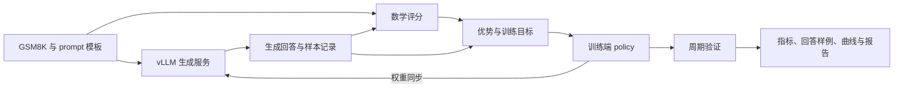
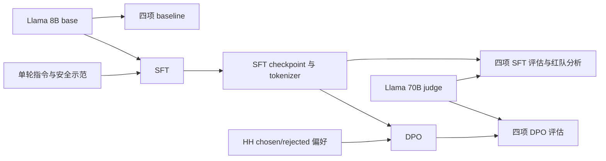

# Assignment 5：项目架构与实战地图

本文面向已经理解 PPO、GRPO 和基本后训练流程，但尚未实际组织训练实验的读者。依据仓库中的 Spring 2026 两份作业 PDF、README、依赖配置和现有源文件整理；检查日期：2026-10-03。具体任务见 [homework.md](homework.md)。本文介绍组件职责与实验组织，不提供作业实现或推导答案。

## 1. 两条学习主线

| 主线 | 主作业：Reasoning RL，必做 | 补充作业：Safety/RLHF，可选 |
|---|---|---|
| 模型 | OLMo-2-0425-1B base | Meta-Llama-3.1-8B base |
| 目标 | 提高 GSM8K 数学题正确率，研究估计器与训练稳定性 | 改善指令遵循与安全行为，同时检查能力变化 |
| 流程 | Prompting → on-policy GRPO → RL 变体 → off-policy → 自拟估计器 | 零样本评估 → SFT → 再评估 → DPO → 再评估 |
| 训练信号 | 对模型自己生成的回答进行数学评分 | SFT 的示范回答；DPO 的 chosen/rejected 偏好对 |
| 评估 | 总奖励、格式奖励、长度、跨随机种子方差等 | MMLU、GSM8K、AlpacaEval、SimpleSafetyTests |

你熟悉 PPO 并不意味着需要在这里搭建完整的 PPO-RLHF 系统。主作业不要求训练 critic 或学习式 reward model；补充作业介绍经典 RLHF，但实际要求实现的是 DPO。先把主线跑通，再决定是否做补充部分。

## 2. 仓库地图：已有组件与待完成部分

| 路径 | 当前职责 | 阅读时应关注的问题 |
|---|---|---|
| 根目录两份 PDF | 任务、公式、接口、实验与交付物的权威来源 | 当前阅读的是主作业还是可选补充？ |
| `README.md` | 基础环境与测试入口 | README 的简略安装说明是否与当前依赖配置一致？ |
| `pyproject.toml`、`uv.lock` | Python、依赖和可选 GPU 环境 | 本地验证与远程 GPU 工作所需依赖有何区别？ |
| `cs336_alignment/` | 学生实现核心逻辑的位置，目前主要是辅助代码 | 哪些功能已有，哪些接口仍需由学生实现？ |
| `cs336_alignment/checkpoint.py` | 加载 Hugging Face 模型与 tokenizer 的辅助函数 | 模型来源、设备、精度与 attention backend 是什么？它不是完整的保存/恢复系统。 |
| `cs336_alignment/vllm_utils.py` | vLLM 服务启动、生成请求、停止、NCCL 权重同步 | 生成进程与训练进程持有的模型是否是同一版本？ |
| `cs336_alignment/drgrpo_grader.py` | 主线数学回答评分辅助工具 | 格式不对和答案错误能否分开观察？ |
| `cs336_alignment/prompts/` | 主线 question_only、r1_zero、三示例提示模板 | 提示词怎样影响模型最初的探索？ |
| `cs336_alignment/prompts_safety/` | 补充部分的系统、任务和 Alpaca SFT 模板 | baseline 与 SFT/DPO 评估使用哪种外层模板？ |
| `cs336_alignment/modal_utils.py` | 主线 Modal 镜像、资源、日志 secret 与远程任务提交 | 用户身份、GPU 和远程文件是否准备齐全？ |
| `cs336_alignment/modal_utils_safety.py` | 补充部分共享资源与个人结果卷 | 输入资源与可持久化输出分别在哪个挂载点？ |
| `tests/adapters.py` | 将学生实现接到官方测试的接口 | 适配器负责连接实现，不能代替核心模块。 |
| `tests/test_grpo.py` | 主线单元测试 | 测试验证局部契约，不能证明完整 RL 实验有效。 |
| `tests/test_data.py`、`test_metrics.py`、`test_dpo.py` | 可选补充部分测试 | 数据、解析器和 DPO 的接口是否满足手册？ |
| `tests/fixtures/`、`tests/_snapshots/` | 小样本和测试参考产物 | 测试样本不等于正式训练数据。 |
| `scripts/evaluate_safety.py` | 补充部分安全评判脚本 | 输入预测格式、judge 模型与输出文件是否匹配？ |
| `scripts/alpaca_eval_vllm_llama3_3_70b_fn/` | AlpacaEval 的 Llama judge 配置 | 候选输出、GPT-4 Turbo 参考和评判模型是三个不同对象。 |
| `data/` | 本地 GSM8K、MMLU、AlpacaEval 参考、SST、HH 数据 | 文件存在之外，是否能正确读取、格式是否完整？ |
| `test_and_make_submission.sh` | 测试与打包入口 | 最终交付包含自己编写的代码与书面报告。 |

手册中逻辑名称 `r1_zero_three_shot` 对应当前文件 `prompts/r1_zero_three_shot_gsm8k.prompt`。不要把文中的名称当成实际存在的文件路径。

## 3. 主线运行时：算法落到哪些组件上

图表达的是职责和数据关系，不是实现步骤。主作业 PDF §3、§4.2–4.3 描述具体契约。

### 3.1 训练模型和生成模型

训练端使用 PyTorch/Transformers，持有梯度和优化器状态；生成端由 vLLM 提供高吞吐采样。它们是同一个逻辑 policy 的不同运行副本。训练更新不会自动出现在生成服务中，因此权重同步是算法语义的一部分。

对你而言，最需要建立的实战习惯是：给每批 rollout 记录它来自哪个 policy 版本。否则“on-policy”可能只是配置名称，实际数据却来自旧权重。

### 3.2 rollout、评分和训练数据

一个 GSM8K 问题对应一个 prompt，同一 prompt 的多个回答组成 group。奖励作用于完整回答，训练使用 token 级概率；response mask 则说明哪些 token 属于回答。prompt、padding、回答 token 不应在日志中混为一类。

数学评分同时提供格式与答案相关信号。奖励低可能来自推理错误，也可能来自输出格式和解析问题，必须结合原始生成文本理解。主线与补充作业的 GSM8K 模板及解析规则不同，不能因为数据集相同就直接复用评估口径。

### 3.3 三种 batch 不要混淆

| 术语 | 含义 | 手册默认设置中的例子 |
|---|---|---|
| prompt 数量 | 本轮抽取多少题 | 32 道题 |
| group size | 每道题生成多少回答 | 8 个回答 |
| rollout batch | 一次生成得到多少回答 | 256 条回答 |
| train batch | 一次 optimizer update 对应的回答数 | on-policy 为 256；off-policy 为 8 |
| microbatch | 单次前向/反向能放进设备的回答数 | 默认设置对应 8 |
| gradient accumulation | 一次更新前累积多少个 microbatch | on-policy 为 32；off-policy 为 1 |

默认 on-policy 对一个 rollout batch 做一次参数更新；off-policy 对同一批回答做 32 次更新。microbatch 的反向次数不等于 optimizer 更新次数。记录 step 时应注明是 rollout step、optimizer step，还是 microbatch。

### 3.4 old policy 与 reference policy

| 对象 | 作用 | 生命周期 |
|---|---|---|
| current policy | 当前正在训练的参数 | 每次参数更新变化 |
| old/sampling policy | 生成某批 rollout 的策略，off-policy 使用其 log-probs | 与该批 rollout 绑定 |
| DPO reference policy | 衡量偏离的固定参照，来自 SFT checkpoint | DPO 阶段保持固定 |
| judge model | 对开放式回答作自动评判 | 补充部分独立运行的 Llama 70B |

这些对象虽然都可能是语言模型，但不能交换职责。特别是 off-policy 的 old log-probs 不等于 DPO 的 reference log-probs。

## 4. 补充主线：训练数据与评估资产

SFT 使用 prompt/response 示例；DPO 使用同一 instruction 下的偏好对。MMLU 与 GSM8K 衡量能力，AlpacaEval 衡量相对偏好，SimpleSafetyTests 衡量被判为安全的比例。安全比例不是数学准确率，胜率也不是训练奖励。

GPT-4 Turbo 的 AlpacaEval JSON 是参考回答资产；实际自动标注使用 Llama-3.3-70B-Instruct。生成耗时与 judge 耗时应分开记录，避免把评判开销误算成待评模型的吞吐。

## 5. 数据与环境准备状态

以下是文件与配置的静态检查结果，不是数据完整性或运行成功的证明。

| 资源 | 当前观察 | 尚需确认 |
|---|---|---|
| 主、补充作业 PDF | 本地均存在且可提取文本 | 后续以课程更新为准 |
| GSM8K | `data/gsm8k/train.jsonl`、`test.jsonl` 已存在 | 全量解析、样本数量和实验子集 |
| MMLU | `data/mmlu/dev/`、`val/`、`test/` 已存在 | 各学科文件完整性与评估 split |
| AlpacaEval | GPT-4 Turbo 参考 JSON 已存在 | 数据字段与候选预测对应关系 |
| SimpleSafetyTests | CSV 已存在 | 字段与预测序列化格式 |
| HH | 四个训练集 gzip 文件已存在 | 解压、读取与单轮筛选后的规模 |
| SFT 正式数据 | 配置指向 Modal 共享卷 | 共享卷访问权限及远程数据可读性；本地 fixture 不能替代 |
| OLMo 权重 | 本次未验证模型缓存 | 下载/缓存与远程加载 |
| Llama 8B、70B 权重 | 配置指向 Modal 共享卷 | 共享卷访问、加载和显存需求 |
| Python 环境 | 当前根目录没有 `.venv` | 可能使用外部环境；本次未验证依赖可运行 |
| Modal 身份 | `SUNET_ID` 仍为 `TODO` | 当前模块会拒绝启动，需要学生配置 |
| Modal 日志 | 使用名为 `wandb` 的 secret | 账号、secret 与权限 |
| `experiments/` | 当前不存在，但 Modal 镜像配置会上传它 | 远程构建前确认目录与实验入口 |
| 核心实现 | adapters 保留 `NotImplementedError` | 尚未完成测试连接；未运行测试 |

所以不能说“整个作业和数据集已经全部准备完成”。可以确认主要手册、脚手架与多类本地数据文件已到位；训练实现与远程资源仍需准备或验证。

依赖要求 Python 3.12；当前 `gpu` extra 包含 vLLM、FlashAttention、AlpacaEval、W&B 等。README 的安装片段较简略，实际环境应同时核对 `pyproject.toml` 和 `uv.lock`，不要仅凭同步了基础依赖就认为 GPU 环境可用。

## 6. 从算法知识到实验经验

下面是实验组织建议，不是作业新增要求。

### 6.1 每次运行留下可解释的产物

建议为每次运行记录：模型与 tokenizer 来源、代码版本、数据路径与子集、prompt 模板、随机种子、算法选项、采样配置、训练配置、开始/结束时间与失败原因。保留指标、原始回答、评分结果、checkpoint 和最终图表，并让这些产物共享同一 run 标识。

Checkpoint 回答“能否恢复模型”，日志回答“训练期间发生了什么”，rollout 回答“模型究竟学到了什么”。只有 checkpoint 或只有一条 reward 曲线都不足以支撑报告。

### 6.2 学会分层判断是否成功

| 层级 | 能说明什么 | 不能说明什么 |
|---|---|---|
| 单元测试通过 | 局部接口与数值契约符合测试 | 完整训练必然有效 |
| 小规模运行完成 | 组件能连接，资源与日志可用 | 算法稳定或性能达标 |
| 验证奖励提高且回答合理 | 有初步端到端学习证据 | 多种子结果可靠 |
| 控制变量、多种子实验 | 可以讨论平均表现与方差 | 能泛化到所有模型与数据集 |

手册允许用 GSM8K 的 `test.jsonl` 作为验证数据；报告中应如实说明这个口径。不要再把调参使用过的数据描述成从未接触的独立测试集。

### 6.3 读曲线时结合原始输出

看到 reward、entropy、梯度范数或回答长度变化时，先问：对应样本是什么？格式奖励与答案奖励是否一起变化？运行是否可比？不同种子的趋势是否一致？不要只凭某次最佳结果判断算法优劣。

主作业要求 loss、梯度范数、token entropy、训练/验证总奖励与格式奖励、验证平均回答长度，off-policy 还要求 clip fraction。额外记录耗时与吞吐有助于理解系统成本，但不应替代规定指标。

## 7. 原始材料

- [主作业 PDF](../cs336_spring2026_assignment5_alignment.pdf)：§3 prompting、§4 GRPO、§5 变体、§6 off-policy、§7 自拟估计器。
- [可选补充 PDF](../cs336_spring2026_assignment5_supplement_safety_rlhf.pdf)：§3 baseline、§4 SFT、§5 评估、§6 DPO。
- [README](../README.md)、[依赖配置](../pyproject.toml)、[测试适配器](../tests/adapters.py)。

本文中的架构图和实验组织建议用于理解工程边界；原手册的接口、限制与交付要求优先。
