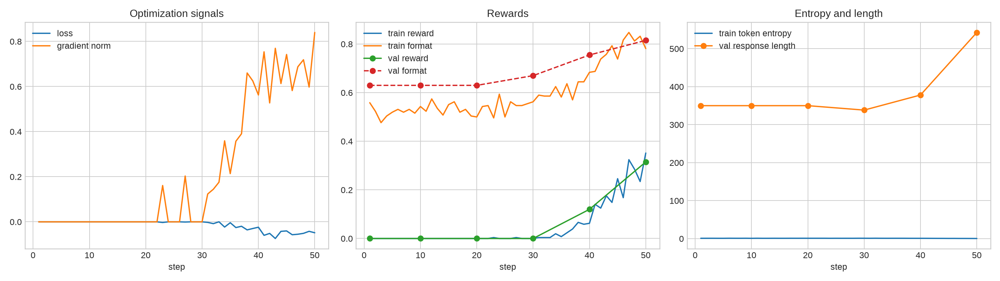
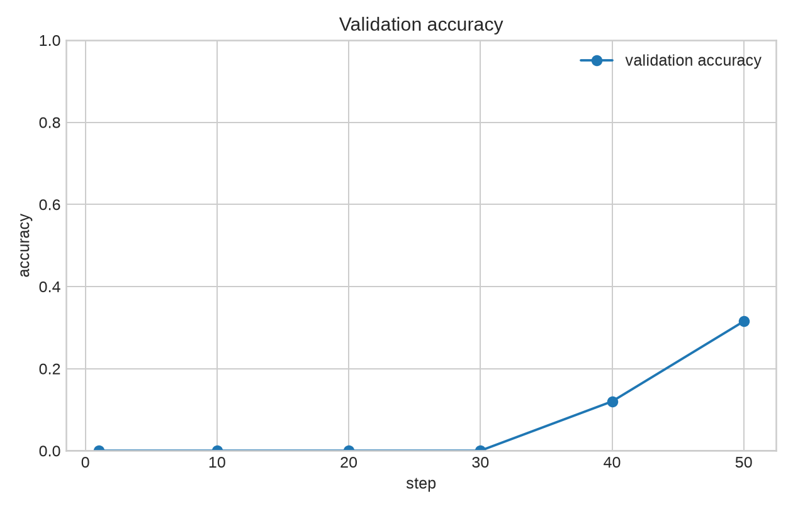

# 标准 On-policy GRPO 调试实验

## 配置

- 模型：`/home/jk/work/models/OLMo-2-0425-1B`
- 任务：GSM8K，`r1_zero` prompt
- 训练集：6400 条；验证集：200 条（调试运行）
- rollout batch：256；group size：8；gradient accumulation：32
- learning rate：`1e-5`；temperature：`1.0`；最大生成长度：512
- 训练步数：50；随机种子：0
- policy 使用 GPU 0，vLLM 使用 GPU 1

## 结果

训练前 20 步的训练 reward 基本为 0；第 23 步首次出现正确回答。之后训练 reward 持续上升，第 50 步达到 `0.352`。验证集 reward 从第 1 步的 `0.000` 上升到第 40 步的 `0.120`，第 50 步达到 `0.315`，验证准确率同样达到 `31.5%`。

格式奖励从 `0.630` 提升到 `0.815`，说明输出格式逐渐稳定。token entropy 从约 `0.96` 降到 `0.39`，表明策略分布变得更集中；平均回答长度在后期增加到约 543 个字符，需要在正式实验中继续观察是否出现长度膨胀。

## Rollout 观察

第 40 步的回答已经较多符合 `<think>...</think><answer>...</answer>` 格式，但仍有计算错误。第 50 步出现了完整正确的推理，例如一道玻璃价格题回答 `$64`，真实答案为 `64`，格式奖励和答案奖励均为 1。

Rollout 样例保存在 [`rollouts.jsonl`](../experiments/grpo_debug_seed0_retry/rollouts.jsonl)，训练指标保存在 [`metrics.jsonl`](../experiments/grpo_debug_seed0_retry/metrics.jsonl)。

## 结论与限制

本次运行验证了模型加载、vLLM 启动、NCCL 权重同步、rollout 生成、GRPO 更新、验证和日志记录均能端到端工作。单个随机种子的 50 步调试结果显示 reward 和 accuracy 明显改善，但验证集只有 200 条，不能替代正式实验。

正式实验应使用 1024 条验证样本、200 步训练和 4 个随机种子，并报告均值及标准差。
